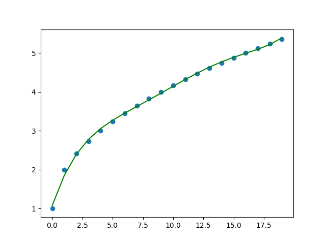

# Monotone functions

We have (x, y) vector and we want f(x) to be a monotonically increasing or decreasing function
of x. f() can be a polynomial or spline.

`find_model(x, y, method='poly')` finds a polynmial model.

